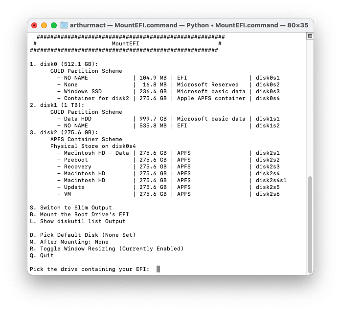

# Arthur MacTavish’s OpenCore Journey

This covers how I built a Hackintosh and “**Why bother making a Hackintosh Build?”**

## NO, THIS IS NOT A TUTORIAL!

**I’m just telling my experience here, so this is not a tutorial!**
There are 1001 reasons why your Hackintosh build doesn’t work. Even the same hardware can produce different results. As such, instead of spending your time reading this as a tutorial, [Dortania’s OpenCore Install Guide](https://dortania.github.io/OpenCore-Install-Guide/) is the best reference out there.

## Why bother making a Hackintosh Build?

Before getting into this “**whole Hackintosh debacle**”, I watched a lot of Hackintosh build videos (usually from [Snazzy Labs](https://www.youtube.com/@snazzy)).
And as time passed, I became interested in Hackintosh. In my mind, I thought:

> Umm… Doing it from scratch is a nightmare, I guess the only option is the prebuilt installer.

I’ve tried that method, but it never boots (stuck). Not even to the installer.

One day, I was watching one of MattKC’s videos, “[Installing macOS on a Microsoft Laptop](https://www.youtube.com/watch?v=S15FVwbHEqo)” (Go ahead, watch it.) and I immediately thought, “Hey, this is a good video!”. That’s because Matt pointed out to use **Dortania’s OC Guide**, something that I haven't even tried

After enough of that, I gained the courage to do this Hackintosh build (for the second time, the first time sucked).

## Computer Specs (I use a PC, not a Laptop)

- CPU: [Intel Core i7-8700](https://ark.intel.com/content/www/us/en/ark/products/126686/intel-core-i78700-processor-12m-cache-up-to-4-60-ghz.html)
- GPU: [MSI Radeon RX580 8GB OC Edition](https://www.msi.com/Graphics-Card/Radeon-RX-580-ARMOR-8G-OC/)
- RAM: 2x8GB (2666 MHz - Previously, I forgot to use XMP.)
- Motherboard: [ASRock Z390-Pro4](https://www.asrock.com/mb/Intel/Z390%20Pro4/index.asp#Specification) (Bios Revision V4.30)
- Audio Codec: Realtek ALC892
- Ethernet Card: [Intel Gigabit I219-V](https://www.intel.com/content/www/us/en/products/sku/82186/intel-ethernet-connection-i219v/specifications.html)
- Wi-Fi USB: [TP-Link TL-WN722Nv2](https://www.tp-link.com/id/home-networking/high-power-adapter/tl-wn722n/)
- ~~Bluetooth: No.~~

## OpenCore Details:

- Version: OpenCore V0.9.4 (Debug Build)
- Kexts:
    - [Lilu](https://github.com/acidanthera/Lilu) (Helps with Patching)
    - [WhateverGreen](https://github.com/acidanthera/WhateverGreen) (GPU Patching)
    - [AppleALC](https://github.com/acidanthera/AppleALC) (For Audio)
    - [VirtualSMC, SMCProcessor & SMCSuperIO](https://github.com/acidanthera/VirtualSMC) (SMC Emulator Layer)
    - [IntelMausi](https://github.com/acidanthera/IntelMausi) (Ethernet Kext)
    - [Wireless USB OC Big Sur Adapter](https://github.com/chris1111/Wireless-USB-OC-Big-Sur-Adapter) (Wi-Fi Kext)*
    
    \*Requires Additional Step
    

## The Drama Starts Here.

### Partitioning Nonsense

Both macOS and Windows partitioning tool sucks. What I do is download Ubuntu Desktop and flash the image to my USB drive (with [Rufus](https://rufus.ie/)). I also make sure to back up my EFI beforehand.

I need 2 partitions. One is for macOS (SSD) and the other one is for the EFI (HDD)

1. For macOS Partition: it’s half of our SSD, and it’s formatted in exFAT (for some dumb reason, macOS refuses to format NTFS partition nor unformatted partition)
2. Bootloader: It’s 512 MB of our HDD, and it’s formatted as FAT32. I also flagged the partition to `boot`.

Why the bootloader is on the HDD but the OS itself is on the SSD?
I don’t want to deal with “whack a ton” of nonsense, especially with a Windows bootloader. As such, putting a different bootloader on a different drive does help.

### Did you get everything right for the first time?

Yes! (sorta) Probably due to highly compatible hardware, especially the GPU since the AMD GPU is natively supported by macOS (AMD Radeon RX 580 is Polaris 20).

We haven’t dealt with Sound, Wi-Fi and everything, so they’re broken.

### First of all. The Internet.

Well, that’s because the router and the PC are that far apart.

Previously, I used HoRNDIS (which is Android USB Tethering Kext) to get online.
Getting online inside the macOS Installer is necessary since what you download is **the recovery image, not the full installer**.

But this time, I got myself a long ethernet cable, so I can connect to the internet with 100 Mbps speed, instead of 20 Mbps.

### Booting without USB

It is as simple as mounting an EFI partition with [MountEFI](https://github.com/corpnewt/MountEFI) and copying over all of the EFI from a USB flash drive.



You can also use `mountvol` in Windows, it’s a bit complicated, but it will do.

### Wi-Fi

I used a **Wireless USB OC Big Sur Adapter** kext (Yup, the name is lengthy as hell.)
This requires you to disable SIP, the simplest way is to choose `Disable SIP (Enable)` from the OpenCore bootloader.

Once that’s done, you can install it! Well, in my case, it doesn’t work immediately.
You see, SSD is registered as drive 1 in macOS, and HDD is drive 2. Since the installer thinks the bootloader is in drive 1, it injects the kexts into drive 1 instead of 2.

Of course, a bit of moving the kexts fix that and we got network!

### Audio.

Believe it or not, the audio works over HDMI. However, I used Sunflower and SunflowerBed since macOS doesn’t support changing the TV volume from the panel.

However, for audio from the audio jack, it’s a different story, the audio itself is from Realtek ALC892, and I need AppleALC for that. But…

I have an issue where “No matter what layout ID I use, it doesn’t work!” So I checked everything using [IORegistryExplorer](https://github.com/khronokernel/IORegistryClone/blob/master/ioreg-302.zip) ([troubleshooting section here](https://dortania.github.io/OpenCore-Post-Install/universal/audio.html#checking-if-applealc-is-patching-correctly)). But in my case, the `alc-layout-id` property is nowhere to be found.

Until I look closer, this section about **[AppleALC working inconsistently](https://dortania.github.io/OpenCore-Post-Install/universal/audio.html#applealc-working-inconsistently)** speaks everything.
It could be that the kext is initialised before the audio device can be picked up by the kext. So I added 1 second delay alongside with layout ID which is 1 (`alcdelay=1000 alcid=1`) and it worked!

So, I followed up by [making the Layout ID more permanent](https://dortania.github.io/OpenCore-Post-Install/universal/audio.html#making-layout-id-more-permanent), and the audio nonsense was finished.

### Graphics and DRM (Encoding Nonsense)

Graphics is a big hole here. I used **iMac19,1** SMBIOS here.

If you know anything about graphics and SMBIOS, iMac SMBIOS uses iGPU and dGPU. iMacPro and MacPro on the other hand, don’t require iGPU for hardware acceleration.

So, here’s what I do. Using this [DRM Chart from WhateverGreen](https://github.com/acidanthera/WhateverGreen/blob/master/Manual/FAQ.Chart.md), I figured out what command I should use.

```bash
defaults write com.apple.AppleGVA gvaForceAMDKE -boolean yes
defaults write com.apple.AppleGVA gvaForceAMDAVCDecode -boolean yes
defaults write com.apple.AppleGVA gvaForceAMDAVCEncode -boolean yes
defaults write com.apple.AppleGVA gvaForceAMDHEVCDecode -boolean yes
defaults write com.apple.AppleGVA disableGVAEncryption -string YES
defaults write com.apple.coremedia hardwareVideoDecoder -string force
```

What this command does is override AMD GPU to be used as AVC/HEVC Decoder/Encoder and for DRM.

To test the DRM ([here’s the link for that](https://dortania.github.io/OpenCore-Post-Install/universal/drm.html#testing-drm)), I used a trailer from Amazon Prime Video and **An American Werewolf in London** movie that I already had in my iTunes library with the Apple TV app.

DRM works, and hardware acceleration works. Video encoding sucks! (Tested with Handbrake)
Somehow, GPU encoding makes the video look worse (here’s the example). If you know what I did wrong, tell me in the Reddit thread.

### Do the Online Services Work? (Can’t 100% Confirm)

I can confirm that Apple TV and App Store work, but for FaceTime and iMessage, I can’t confirm that.
In Indonesia (where country I lived in), virtually, no one uses iMessage or FaceTime. The only standard here is SMS or WhatsApp. And no, we’re Android households. So iMessage and FaceTime remain a mystery.

### USB? (A bit broken)

USB is a rabbit hole, all port works, and that’s good. But, when I tried to plug my USB 3 device into the USB 3 port, it didn’t work. Although the port itself is useable for USB 2 devices. USB 3 Device also worked in the USB 2 port.

Hopefully, someone can figure it out, if you know, let us know!


## That’s all from me!

If you guys have a question, let me know.

Email: [ArthurMacTavish@outlook.com](mailto:ArthurMacTavish@outlook.com)

Instagram: [@reuben.hu](https://instagram.com/reuben.hu/)

Reddit: [u/GearFlame](https://reddit.com/u/gearflame/)

Twitter: [@ArthurMacTavish](https://twitter.com/ArthurMacTavish/)